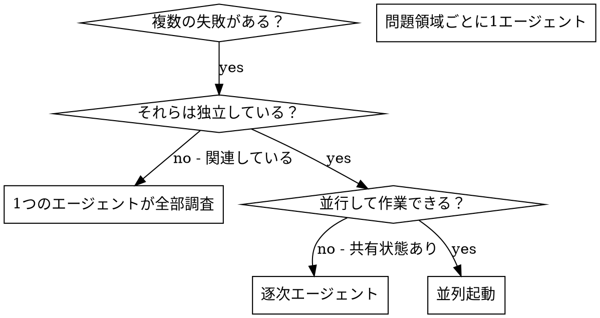

# 並列エージェントの起動

## 概要

複数の無関係な失敗（異なるテストファイル、異なるサブシステム、異なるバグ）がある場合、順番に調査すると時間の無駄になる。各調査は独立しており、並行して進められる。

**核心原則:** 独立した問題領域ごとに1つのエージェントを起動する。同時に作業させる。

## 使用する場面



**使用するとき:**
- 異なる根本原因で3+つのテストファイルが失敗している
- 複数のサブシステムが独立して壊れている
- 各問題が他の問題のコンテキストなしに理解できる
- 調査間で共有状態がない

**使用しないとき:**
- 失敗が関連している（一方を修正すると他方も修正される可能性）
- 完全なシステム状態を理解する必要がある
- エージェントが互いに干渉する

## パターン

### 1. 独立した領域を特定する

失敗を何が壊れているかでグループ化:
- ファイルAのテスト: ツール承認フロー
- ファイルBのテスト: バッチ完了動作
- ファイルCのテスト: 中断機能

各領域は独立している - ツール承認を修正しても中断テストには影響しない。

### 2. 焦点を絞ったエージェントタスクを作成する

各エージェントが受け取るもの:
- **具体的なスコープ:** 1つのテストファイルまたはサブシステム
- **明確なゴール:** これらのテストをパスさせる
- **制約:** 他のコードは変更しない
- **期待される出力:** 発見と修正内容のまとめ

### 3. 並列で起動する

```typescript
// Claude Code / AI 環境で
Task("agent-tool-abort.test.ts の失敗を修正")
Task("batch-completion-behavior.test.ts の失敗を修正")
Task("tool-approval-race-conditions.test.ts の失敗を修正")
// 3つが同時に実行される
```

### 4. レビューと統合

エージェントが戻ってきたら:
- 各まとめを読む
- 修正が競合しないか確認する
- フルテストスイートを実行する
- 全ての変更を統合する

## エージェントプロンプトの構造

良いエージェントプロンプトは:
1. **焦点が絞られている** - 1つの明確な問題領域
2. **自己完結している** - 問題を理解するために必要な全てのコンテキスト
3. **出力が具体的** - エージェントは何を返すべきか？

```markdown
src/agents/agent-tool-abort.test.ts の3つの失敗するテストを修正:

1. "should abort tool with partial output capture" - 'interrupted at' というメッセージが期待される
2. "should handle mixed completed and aborted tools" - 高速ツールが完了ではなく中断された
3. "should properly track pendingToolCount" - 3件の結果が期待されるが0件になる

これらはタイミング/レース条件の問題。タスク:

1. テストファイルを読んで各テストが何を検証するか理解する
2. 根本原因を特定する - タイミングの問題か実際のバグか？
3. 以下で修正:
   - 任意のタイムアウトをイベントベースの待機に置き換える
   - 見つかれば中断実装のバグを修正
   - 動作が変更された場合はテストの期待値を調整

タイムアウトを単に増やさない - 本当の問題を見つける。

返す: 発見した内容と修正した内容のまとめ。
```

## よくある間違い

**❌ 広すぎる:** 「全てのテストを修正」- エージェントが迷子になる
**✅ 具体的:** 「agent-tool-abort.test.ts を修正」- 焦点が絞られたスコープ

**❌ コンテキストなし:** 「レース条件を修正」- エージェントがどこか分からない
**✅ コンテキストあり:** エラーメッセージとテスト名を貼り付ける

**❌ 制約なし:** エージェントが全てをリファクタリングするかもしれない
**✅ 制約あり:** 「本番コードを変更しない」または「テストのみ修正」

**❌ 曖昧な出力:** 「修正して」- 何が変わったか分からない
**✅ 具体的:** 「根本原因と変更のまとめを返す」

## 使用しない場合

**関連した失敗:** 一方を修正すると他方も修正される - まず一緒に調査する
**完全なコンテキストが必要:** 理解にはシステム全体を見る必要がある
**探索的デバッグ:** 何が壊れているかまだ分かっていない
**共有状態:** エージェントが干渉する（同じファイルを編集、同じリソースを使用）

## セッションからの実例

**シナリオ:** 大規模リファクタリング後、3ファイルにわたる6件のテスト失敗

**失敗:**
- agent-tool-abort.test.ts: 3件（タイミングの問題）
- batch-completion-behavior.test.ts: 2件（ツールが実行されない）
- tool-approval-race-conditions.test.ts: 1件（実行回数 = 0）

**決断:** 独立した領域 - 中断ロジックはバッチ完了とレース条件から独立

**起動:**
```
エージェント1 → agent-tool-abort.test.ts を修正
エージェント2 → batch-completion-behavior.test.ts を修正
エージェント3 → tool-approval-race-conditions.test.ts を修正
```

**結果:**
- エージェント1: タイムアウトをイベントベースの待機に置き換え
- エージェント2: イベント構造のバグを修正（threadIdが間違った場所）
- エージェント3: 非同期ツール実行完了の待機を追加

**統合:** 全ての修正が独立しており、競合なし、フルスイートがグリーン

**節約された時間:** 3問題が順番ではなく並行して解決

## 主なメリット

1. **並列化** - 複数の調査が同時に実行される
2. **焦点** - 各エージェントが狭いスコープを持ち、追跡するコンテキストが少ない
3. **独立性** - エージェントが互いに干渉しない
4. **速度** - 3問題が1問題の時間で解決

## 検証

エージェントが戻ってきたら:
1. **各まとめを確認** - 何が変わったか理解する
2. **競合を確認** - エージェントは同じコードを編集したか？
3. **フルスイートを実行** - 全ての修正が連携して動作することを確認する
4. **スポットチェック** - エージェントは系統的なエラーを犯す可能性がある
