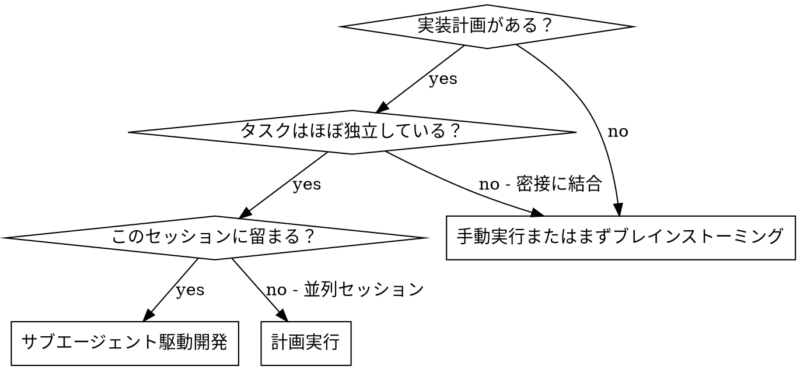
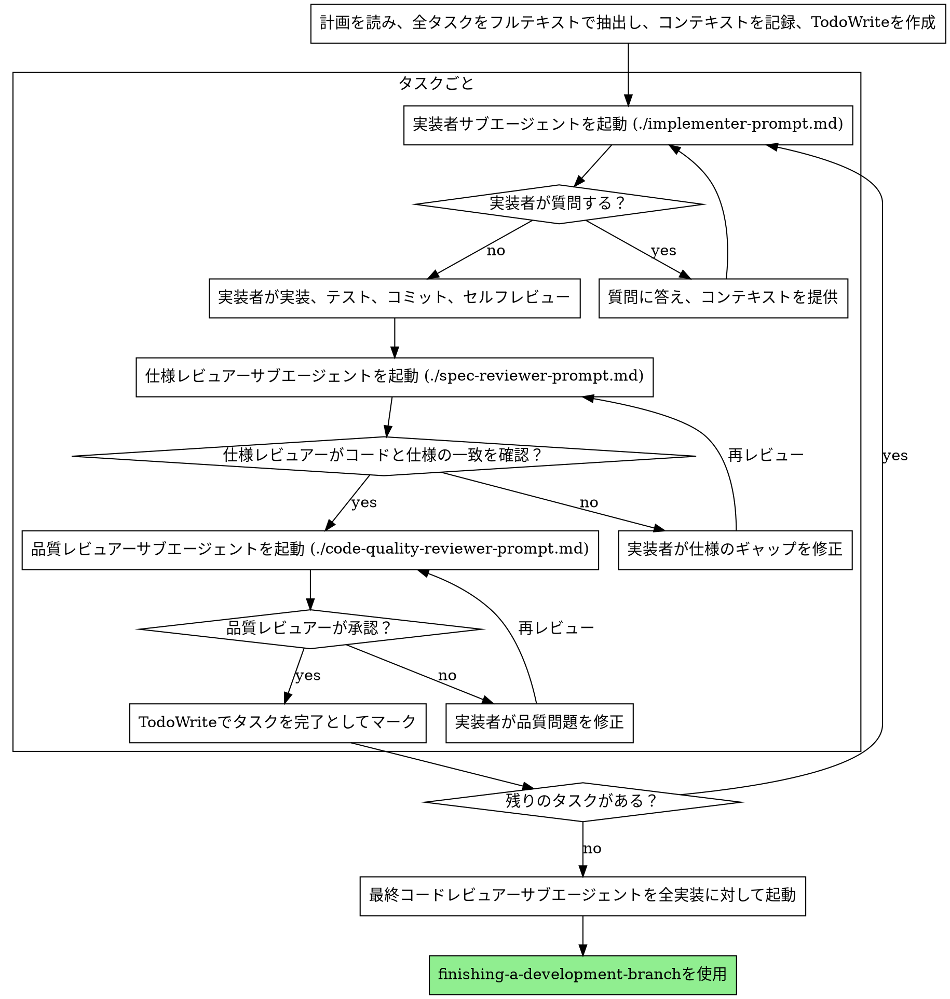

# サブエージェント駆動開発

タスクごとに新鮮なサブエージェントを起動し、各タスク後に2段階レビューを実施（仕様適合レビュー → コード品質レビュー）して計画を実行する。

**核心原則:** タスクごとに新鮮なサブエージェント + 2段階レビュー（仕様 → 品質）= 高品質、高速イテレーション

## 使用する場面



**計画実行（並列セッション）との違い:**
- 同じセッション（コンテキスト切り替えなし）
- タスクごとに新鮮なサブエージェント（コンテキスト汚染なし）
- 各タスク後に2段階レビュー: まず仕様適合、次にコード品質
- 高速イテレーション（タスク間に人間のループなし）

## プロセス



## プロンプトテンプレート

- `./implementer-prompt.md` - 実装者サブエージェントの起動
- `./spec-reviewer-prompt.md` - 仕様適合レビュアーサブエージェントの起動
- `./code-quality-reviewer-prompt.md` - コード品質レビュアーサブエージェントの起動

## ワークフロー例

```
あなた: サブエージェント駆動開発を使ってこの計画を実行します。

[計画ファイルを一度読む: docs/plans/feature-plan.md]
[フルテキストとコンテキストで全5タスクを抽出]
[全タスクでTodoWriteを作成]

タスク1: フックインストールスクリプト

[タスク1のテキストとコンテキストを取得（既に抽出済み）]
[フルタスクテキスト+コンテキストで実装サブエージェントを起動]

実装者: 「始める前に - フックはユーザーレベルとシステムレベルのどちらにインストールすべきですか？」

あなた: 「ユーザーレベル（~/.config/superpowers/hooks/）」

実装者: 「了解。実装中...」
[後で] 実装者:
  - install-hookコマンドを実装
  - テスト追加、5/5パス
  - セルフレビュー: --forceフラグを見逃した、追加した
  - コミット済み

[仕様適合レビュアーを起動]
仕様レビュアー: ✅ 仕様適合 - 全要件を満たし、余分なものなし

[git SHAを取得、コード品質レビュアーを起動]
コードレビュアー: 強み: 良いテストカバレッジ、クリーン。問題: なし。承認。

[タスク1を完了としてマーク]

タスク2: 復旧モード

[タスク2のテキストとコンテキストを取得（既に抽出済み）]
[フルタスクテキスト+コンテキストで実装サブエージェントを起動]

実装者: [質問なし、進行]
実装者:
  - 検証/修復モードを追加
  - 8/8テストパス
  - セルフレビュー: 全て良好
  - コミット済み

[仕様適合レビュアーを起動]
仕様レビュアー: ❌ 問題:
  - 不足: 進捗レポート（仕様は「100件ごとに報告」と指定）
  - 余分: --jsonフラグを追加（リクエストされていない）

[実装者が問題を修正]
実装者: --jsonフラグを削除、進捗レポートを追加

[仕様レビュアーが再レビュー]
仕様レビュアー: ✅ 仕様適合

[コード品質レビュアーを起動]
コードレビュアー: 強み: 堅固。問題（Important）: マジックナンバー（100）

[実装者が修正]
実装者: PROGRESS_INTERVAL定数を抽出

[コードレビュアーが再レビュー]
コードレビュアー: ✅ 承認

[タスク2を完了としてマーク]

...

[全タスク完了後]
[最終コードレビュアーを起動]
最終レビュアー: 全要件を満たし、マージ準備完了

完了！
```

## メリット

**手動実行との比較:**
- サブエージェントが自然にTDDに従う
- タスクごとに新鮮なコンテキスト（混乱なし）
- 並列安全（サブエージェントが干渉しない）
- サブエージェントが質問できる（作業前も中も）

**計画実行との比較:**
- 同じセッション（ハンドオフなし）
- 継続的な進捗（待機なし）
- レビューチェックポイントが自動

**効率化:**
- ファイル読み込みオーバーヘッドなし（コントローラーがフルテキストを提供）
- コントローラーが必要なコンテキストを正確にキュレート
- サブエージェントが最初から完全な情報を取得
- 作業開始前に質問が浮かび上がる

**品質ゲート:**
- セルフレビューで問題をハンドオフ前に捕捉
- 2段階レビュー: 仕様適合、次にコード品質
- レビューループで修正が実際に機能することを保証
- 仕様適合でオーバー/アンダービルドを防ぐ
- コード品質で実装が適切に構築されることを保証

## 危険サイン

**絶対にNG:**
- レビューをスキップする（仕様適合またはコード品質のいずれも）
- 未修正の問題で進む
- 複数の実装サブエージェントを並行して起動（競合）
- サブエージェントに計画ファイルを読ませる（代わりにフルテキストを提供）
- 場面設定のコンテキストをスキップ（サブエージェントはタスクがどこに収まるか理解が必要）
- サブエージェントの質問を無視（進める前に答える）
- 仕様適合で「だいたい合っている」を受け入れる（仕様レビュアーが問題を発見 = 完了していない）
- レビューループをスキップ（レビュアーが問題を発見 = 実装者が修正 = 再レビュー）
- 実装者のセルフレビューで実際のレビューを代替させる（両方必要）
- **仕様適合が✅になる前にコード品質レビューを開始**（順序が間違い）
- いずれかのレビューが未解決の問題を抱えたまま次のタスクへ進む

**サブエージェントが質問する場合:**
- 明確かつ完全に答える
- 必要に応じて追加のコンテキストを提供する
- 実装に急かさない

**レビュアーが問題を発見した場合:**
- 実装者（同じサブエージェント）が修正する
- レビュアーが再レビューする
- 承認されるまで繰り返す
- 再レビューをスキップしない

**サブエージェントがタスクに失敗した場合:**
- 具体的な指示を持つ修正サブエージェントを起動する
- 手動で修正しようとしない（コンテキスト汚染）

## 統合

**必要なワークフロースキル:**
- **writing-plans** - このスキルが実行する計画を作成
- **requesting-code-review** - レビュアーサブエージェント用のコードレビューテンプレート
- **finishing-a-development-branch** - 全タスク後に開発を完了

**サブエージェントが使用すべきもの:**
- **test-driven-development** - サブエージェントが各タスクでTDDに従う

**代替ワークフロー:**
- **executing-plans** - 同じセッション実行の代わりに並列セッションを使用
