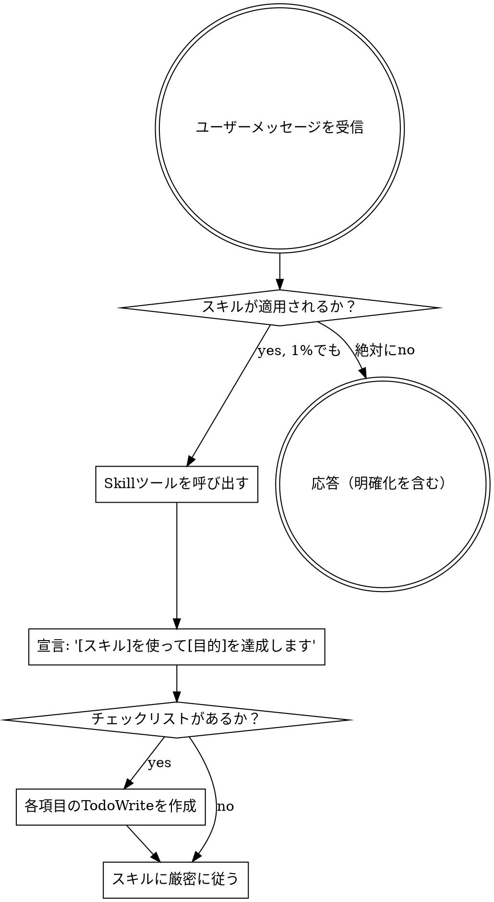

<EXTREMELY-IMPORTANT>
スキルが自分のやっていることに1%でも適用される可能性があると思ったら、絶対にそのスキルを呼び出さなければならない。

スキルがタスクに適用される場合、選択の余地はない。使用しなければならない。

これは交渉できない。任意ではない。合理化で回避することはできない。
</EXTREMELY-IMPORTANT>

## スキルへのアクセス方法

**Claude Codeで:** `Skill` ツールを使用する。スキルを呼び出すとその内容が読み込まれて提示される - それに直接従う。スキルファイルにReadツールを使ってはならない。

**他の環境で:** スキルがどのように読み込まれるか、プラットフォームのドキュメントを確認する。

# スキルの使用

## ルール

**いかなる応答や行動の前にも、関連するまたはリクエストされたスキルを呼び出す。** スキルが適用されるかもしれない1%の可能性でもあれば、確認するためにスキルを呼び出す。呼び出したスキルがその状況に合っていなかった場合は、使用する必要はない。

## 危険サイン

以下の考えが浮かんだら STOP - 合理化している:

| 考え | 現実 |
|------|------|
| 「これは単純な質問だ」 | 質問はタスク。スキルを確認する。 |
| 「まずコンテキストが必要」 | スキル確認は明確化の質問の前に来る。 |
| 「まずコードベースを調べよう」 | スキルが調べ方を教える。まず確認する。 |
| 「git/ファイルをすぐ確認できる」 | ファイルには会話のコンテキストがない。スキルを確認する。 |
| 「まず情報を集めよう」 | スキルが情報の集め方を教える。 |
| 「正式なスキルは必要ない」 | スキルが存在するなら使う。 |
| 「このスキルを覚えている」 | スキルは進化する。現在のバージョンを読む。 |
| 「これはタスクじゃない」 | 行動 = タスク。スキルを確認する。 |
| 「スキルは大げさ」 | 単純なことが複雑になる。使う。 |
| 「これだけ先にやろう」 | 何かをする前に確認する。 |
| 「これは生産的に感じる」 | 無秩序な行動は時間を無駄にする。スキルがこれを防ぐ。 |
| 「その意味は分かっている」 | 概念を知ること ≠ スキルを使うこと。呼び出す。 |

## スキルの優先順位

複数のスキルが適用できる場合、以下の順序で使用する:

1. **プロセススキル優先**（ブレインストーミング、デバッグ）- タスクへのアプローチ方法を決める
2. **実装スキルを次に**（フロントエンドデザイン、mcp-builder）- 実行を導く

「Xを構築しよう」→ まずブレインストーミング、次に実装スキル。
「このバグを修正」→ まずデバッグ、次にドメイン固有スキル。

## スキルの種類

**厳格**（TDD、デバッグ）: 厳密に従う。規律から逸脱しない。

**柔軟**（パターン）: 原則をコンテキストに合わせる。

スキル自体がどちらかを示す。

## ユーザーの指示

指示は「何を」であって「どのように」ではない。「Xを追加」や「Yを修正」はワークフローをスキップする意味ではない。
