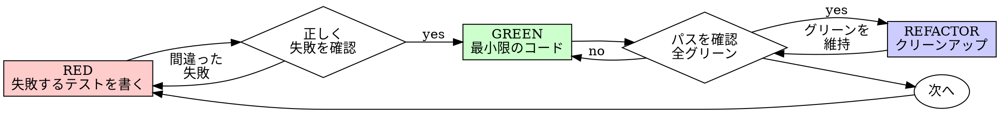

# テスト駆動開発（TDD）

> **このスキルは「哲学・原則」重視。** なぜ TDD を守るか、よくある合理化への反論、絶対ルールを詳述する。
> TDD の具体的な手順ガイド → [`tdd-workflow`](../tdd-workflow/SKILL.md)

## 概要

まずテストを書く。失敗を確認する。パスする最小限のコードを書く。

**核心原則:** テストが失敗するのを見ていなければ、それが正しいことをテストしているかわからない。

**このルールの文字を違反することは、精神を違反すること。**

## 使用する場面

**常に:**
- 新機能
- バグ修正
- リファクタリング
- 動作の変更

**例外（ユーザーに確認）:**
- 使い捨てプロトタイプ
- 生成されたコード
- 設定ファイル

「今回だけTDDをスキップしよう」と思ったら: Stop。それは合理化。

## 絶対のルール

```
失敗するテストなしに本番コードを書いてはならない
```

テストの前にコードを書いた？削除する。最初からやり直す。

**例外なし:**
- 「参考のため」に残してはいけない
- テストを書きながら「適応」してはいけない
- 見てはいけない
- 削除は削除を意味する

テストから新鮮に実装する。以上。

## レッド-グリーン-リファクタリング



### RED - 失敗するテストを書く

何が起きるべきかを示す最小限のテストを一つ書く。

<Good>
```typescript
test('失敗した操作を3回リトライする', async () => {
  let attempts = 0;
  const operation = () => {
    attempts++;
    if (attempts < 3) throw new Error('fail');
    return 'success';
  };

  const result = await retryOperation(operation);

  expect(result).toBe('success');
  expect(attempts).toBe(3);
});
```
明確な名前、実際の動作をテスト、一つのこと
</Good>

<Bad>
```typescript
test('retry works', async () => {
  const mock = jest.fn()
    .mockRejectedValueOnce(new Error())
    .mockRejectedValueOnce(new Error())
    .mockResolvedValueOnce('success');
  await retryOperation(mock);
  expect(mock).toHaveBeenCalledTimes(3);
});
```
曖昧な名前、コードではなくモックをテスト
</Bad>

**要件:**
- 一つの動作
- 明確な名前
- 実際のコード（モックは避けられない場合のみ）

### Verify RED - 失敗を確認する

**必須。絶対にスキップしない。**

```bash
npm test path/to/test.test.ts
```

確認:
- テストが失敗する（エラーではない）
- 失敗メッセージが期待通り
- 機能が不足しているから失敗する（タイポではない）

**テストがパスする？** 既存の動作をテストしている。テストを修正する。

**テストにエラーが出る？** エラーを修正し、正しく失敗するまで再実行する。

### GREEN - 最小限のコード

テストをパスさせる最もシンプルなコードを書く。

<Good>
```typescript
async function retryOperation<T>(fn: () => Promise<T>): Promise<T> {
  for (let i = 0; i < 3; i++) {
    try {
      return await fn();
    } catch (e) {
      if (i === 2) throw e;
    }
  }
  throw new Error('unreachable');
}
```
パスさせるのに十分なだけ
</Good>

<Bad>
```typescript
async function retryOperation<T>(
  fn: () => Promise<T>,
  options?: {
    maxRetries?: number;
    backoff?: 'linear' | 'exponential';
    onRetry?: (attempt: number) => void;
  }
): Promise<T> {
  // YAGNI - 過剰設計
}
```
過剰設計
</Bad>

テストを超えた機能、他のコードのリファクタリング、「改善」を追加しない。

### Verify GREEN - パスを確認する

**必須。**

```bash
npm test path/to/test.test.ts
```

確認:
- テストがパスする
- 他のテストがまだパスする
- 出力がクリーン（エラー、警告なし）

**テストが失敗する？** テストではなくコードを修正する。

**他のテストが失敗する？** 今すぐ修正する。

### REFACTOR - クリーンアップ

グリーンになった後のみ:
- 重複を除去
- 名前を改善
- ヘルパーを抽出

テストをグリーンに保つ。動作を追加しない。

### 繰り返す

次の機能のために次の失敗するテストへ。

## 良いテスト

| 品質 | 良い | 悪い |
|------|------|------|
| **最小限** | 一つのこと。名前に「and」がある？分割する。 | `test('メールとドメインとスペースを検証する')` |
| **明確** | 名前が動作を説明する | `test('test1')` |
| **意図を示す** | 望ましいAPIをデモンストレーション | コードが何をすべきかを曖昧にする |

## 順序が重要な理由

**「後でテストを書いて動作確認する」**

コードの後に書かれたテストはすぐにパスする。すぐにパスすることは何も証明しない:
- 間違ったことをテストしているかもしれない
- 動作ではなく実装をテストしているかもしれない
- 忘れたエッジケースを見逃すかもしれない
- テストがバグをキャッチするのを見たことがない

テスト先行は、テストが失敗するのを見ることを強制し、実際に何かをテストしていることを証明する。

**「テストが難しい = 設計が不明確」**

テストに耳を傾ける。テストしにくい = 使いにくい。インターフェースを簡素化する。

## よくある合理化

| 言い訳 | 現実 |
|--------|------|
| 「テストするには単純すぎる」 | 単純なコードは壊れる。テストは30秒。 |
| 「後でテストする」 | すぐにパスするテストは何も証明しない。 |
| 「後のテストで同じ目標を達成する」 | テスト後 = 「これは何をするか？」テスト先行 = 「これは何をすべきか？」 |
| 「既に手動でテストした」 | アドホック ≠ 体系的。記録なし、再実行不可。 |
| 「X時間の作業を削除するのは無駄」 | 埋没費用の誤謬。検証されていないコードを保持することが技術的負債。 |
| 「参考のために保持してテスト先行で書く」 | 適応することになる。それはテスト後。削除は削除を意味する。 |
| 「先に探索が必要」 | OK。探索を捨て、TDDで開始する。 |
| 「TDDは速度を落とす」 | TDDはデバッグより速い。実用的 = テスト先行。 |

## 危険サイン - STOPして最初からやり直す

- テストの前にコード
- 実装後にテスト
- テストがすぐにパスする
- テストがなぜ失敗したか説明できない
- テストを「後で」追加する
- 「今回だけ」を合理化する
- 「既に手動でテストした」
- 「テスト後でも同じ目的を達成する」
- 「儀式ではなく精神のことだ」
- 「参考のために保持」または「既存コードを適応」
- 「既にX時間費やした、削除は無駄」
- 「TDDは独断的、私は実用的に行動している」
- 「これは違う、なぜなら...」

**これら全ては意味する: コードを削除する。TDDで最初からやり直す。**

## 例: バグ修正

**バグ:** 空のメールが受け付けられる

**RED**
```typescript
test('空のメールを拒否する', async () => {
  const result = await submitForm({ email: '' });
  expect(result.error).toBe('メールは必須です');
});
```

**Verify RED**
```bash
$ npm test
FAIL: expected 'メールは必須です', got undefined
```

**GREEN**
```typescript
function submitForm(data: FormData) {
  if (!data.email?.trim()) {
    return { error: 'メールは必須です' };
  }
  // ...
}
```

**Verify GREEN**
```bash
$ npm test
PASS
```

**REFACTOR**
必要に応じて複数フィールドのバリデーションを抽出する。

## 検証チェックリスト

作業を完了とマークする前に:

- [ ] 全ての新しい関数/メソッドにテストがある
- [ ] 実装前に各テストが失敗するのを見た
- [ ] 各テストが期待される理由で失敗した（機能不足、タイポではない）
- [ ] 各テストをパスさせる最小限のコードを書いた
- [ ] 全テストがパスする
- [ ] 出力がクリーン（エラー、警告なし）
- [ ] テストが実際のコードを使用する（やむを得ない場合のみモック）
- [ ] エッジケースとエラーがカバーされている

全てのチェックボックスをチェックできない？TDDをスキップした。最初からやり直す。

## 行き詰まった場合

| 問題 | 解決策 |
|------|--------|
| テスト方法がわからない | 望ましいAPIを書く。先にアサーションを書く。ユーザーに質問する。 |
| テストが複雑すぎる | 設計が複雑すぎる。インターフェースを簡素化する。 |
| 全てをモックしなければならない | コードが結合しすぎ。依存性注入を使う。 |
| テストのセットアップが巨大 | ヘルパーを抽出する。まだ複雑？設計を簡素化する。 |

## デバッグとの統合

バグが見つかった？それを再現する失敗するテストを書く。TDDサイクルに従う。テストが修正を証明し、リグレッションを防ぐ。

テストなしにバグを修正しない。

## 最終ルール

```
本番コード → テストが存在し、先に失敗した
そうでなければ → TDDではない
```

ユーザーの許可なしに例外なし。
